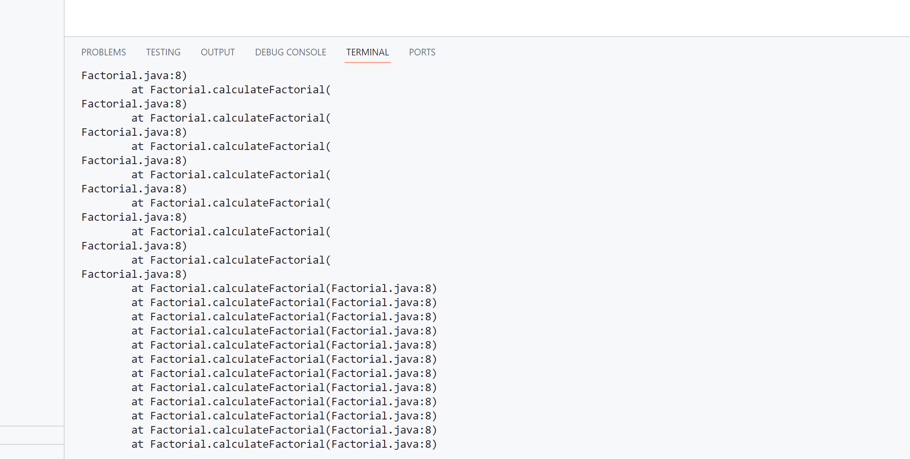

# Lab Report  5
## Zeke Wang

### Part 1

Student's original post: 

Hello everyone, I have an issue with my java program. I'm trying to calculate the factorial of a number, but when I run my code, I get an infinite loop of error messages. Here's a screenshot of the error and my code: 

code: 
```
public class Factorial {
    public static void main(String[] args) {
        int n = 5;
        System.out.println("Factorial of " + n + " is: " + calculateFactorial(n));
    }

    public static int calculateFactorial(int num) {
        return num * calculateFactorial(num - 1); // Error: Infinite recursion
    }
}
```
Error screenshot: 



TA's response: 

It looks like your program is encountering a StackOverflowError due to infinite recursion in your calculateFactorial method. To debug, try running your program with a smaller input value. Also, take a look at your calculateFactorial method and ensure there's a base case to break out of the recursion.

Uses these commands to compile and run your program with a smaller input value again: 
```
javac Factorial.java
java Factorial
```

Student's follow up: 

After running my program with a smaller input value, indeed, I'm getting the same infinite loop of error messages. Here's a screenshot of the terminal output:


To fix this, I will add a base case to stop the recursion when n is less or equal to 1. Here is the updated code and screenshot that it no longer has the error message: 

Code:
```
public class Factorial {
    public static void main(String[] args) {
        int n = 5;
        System.out.println("Factorial of " + n + " is: " + calculateFactorial(n));
    }

    public static int calculateFactorial(int num) {
        if (num <= 1) {
            return 1;
        } else {
            return num * calculateFactorial(num - 1);
        }
    }
}
```

Here is a screenshot that it work without the error: 


Here is the code for the bash test.sh and the screenshot of the passed test: 
```
javac Factorial.java

output=$(java Factorial 2>&1)

if [[ "$output" == *"StackOverflowError"* ]]; then
    echo "Test Passed: StackOverflowError caught"
else
    echo "Test Failed: StackOverflowError not caught"
fi
```


### Part 2
To me, learning about Vim was both challenging and rewarding. Its modal editing system, while initially confusing and hard to use, eventually revealed its efficiency and speed benefits in text manipulation. The minimalist interface, coupled with extensive customization possibilities, provided a very efficient way to work. Despite the initial hardships and confusion, I think Vim's unique efficiency makes it a valuable skill for developers seeking mastery over their coding environments.
